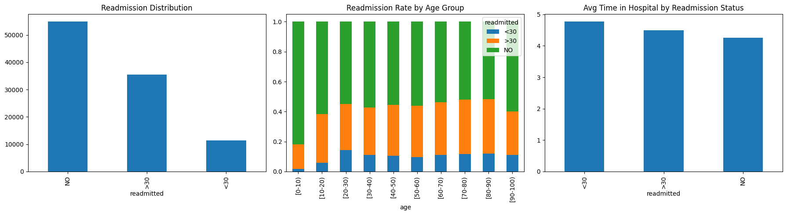
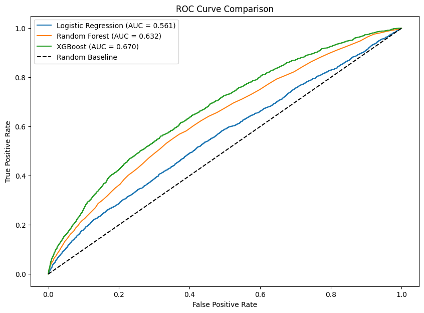
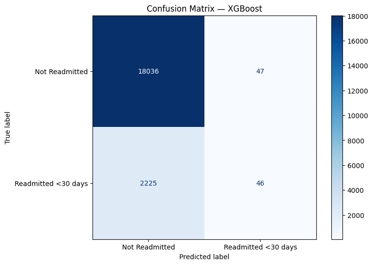
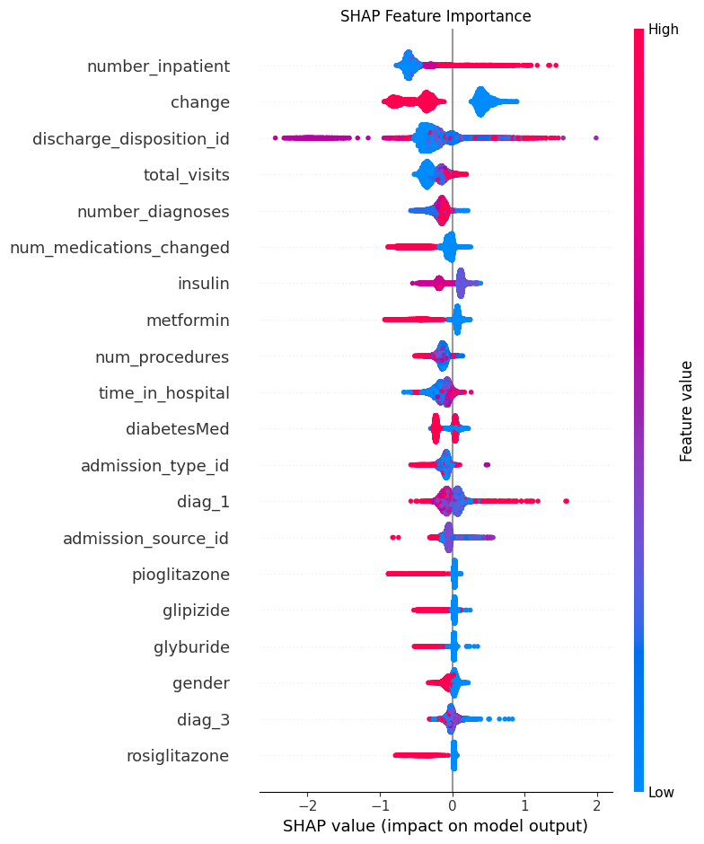

# 🏥 Hospital Readmission Predictor

Predicting whether a diabetic patient will be readmitted to hospital within 30 days of discharge using machine learning — a real problem that costs healthcare systems billions annually.

---

## Why This Problem Matters

Unplanned hospital readmissions place enormous pressure on healthcare systems. In the UK, the NHS spends hundreds of millions each year on avoidable readmissions. In the US, Medicare alone penalises hospitals financially for excessive 30-day readmission rates. An accurate early-warning model can help clinicians intervene before a patient deteriorates — potentially saving both lives and resources.

---

## Dataset

**Source:** [UCI Diabetes 130-US Hospitals (1999–2008)](https://archive.ics.uci.edu/dataset/296/diabetes+130-us+hospitals+for+years+1999-2008)

- **Size:** 101,766 patient encounters across 130 US hospitals
- **Features:** 50 features including patient demographics, diagnoses, lab results, medications, and prior visit history
- **Target:** Binary — was the patient readmitted within 30 days? (1 = yes, 0 = no)
- **Class distribution:** 11.16% readmitted within 30 days (imbalanced)
- **License:** CC BY 4.0

---

## Methodology

### 1. Exploratory Data Analysis
- Examined target class distribution, missing value patterns, and feature distributions
- Investigated relationships between readmission rates and key variables: age group, time in hospital, number of diagnoses, and prior visit history
- Identified that the dataset uses `?` to encode missing values across several categorical columns

### 2. Data Preprocessing
- Replaced `?` placeholder values with `NaN`
- Dropped columns exceeding 40% missing values
- Removed non-predictive identifier columns (`encounter_id`, `patient_nbr`)
- Binarised the target variable: `<30` days readmission → 1, all others → 0

### 3. Feature Engineering
- Created `num_medications_changed` — count of medications adjusted (up or down) during the encounter
- Created `total_visits` — sum of prior outpatient, emergency, and inpatient visits
- Label-encoded categorical variables; standardised numerical features with `StandardScaler`

### 4. Handling Class Imbalance
Applied **SMOTE (Synthetic Minority Oversampling Technique)** to balance the training set from 11.16% minority class to a fully balanced 50/50 split (72,326 samples per class) before model training.

### 5. Model Training & Comparison
Trained and evaluated three models on a held-out test set (20,354 samples):

| Model | AUC-ROC |
|---|---|
| Logistic Regression | 0.5608 |
| Random Forest | 0.6320 |
| **XGBoost** | **0.6703** |

**Best Model: XGBoost** with an AUC-ROC of 0.6703

### 6. Explainability with SHAP
Applied **SHAP (SHapley Additive exPlanations)** to the XGBoost model to identify which features most influenced readmission predictions — a critical requirement in healthcare where black-box models are not clinically trusted.

---

## Results

### ROC Curve Comparison

### Confusion Matrix (XGBoost)

### SHAP Feature Importance

---

## Key Findings

- **Prior inpatient visits (`number_inpatient`) was the strongest predictor of readmission** — patients with more previous hospitalisations carried significantly higher risk, consistent with clinical literature on complex chronic patients.
- **Medication changes (`change`, `num_medications_changed`, `insulin`) were highly influential** — adjustments to diabetes medications, particularly insulin, during a hospital encounter were associated with elevated readmission risk.
- **Discharge disposition mattered significantly** — how and where a patient was discharged (home, transferred, against medical advice) had a strong impact on predicted readmission probability.
- **Older age groups (70–90) showed higher readmission rates** across all categories, reflecting the increased clinical complexity of elderly diabetic patients.
- **XGBoost outperformed both Logistic Regression and Random Forest** on AUC-ROC, though all models struggled with recall on the minority (readmitted) class — a known challenge with this dataset reflecting the genuine difficulty of readmission prediction.

---

## Limitations

- **Dataset age:** The data spans 1999–2008. Clinical practices, medications, and documentation standards have evolved significantly since then. A production-grade model would require retraining on current data.
- **Data availability:** Modern versions of this problem would use Electronic Health Record (EHR) systems with far richer, more recent patient data. However, real EHR data is not publicly available due to strict patient privacy regulations — HIPAA in the United States and GDPR in the United Kingdom — making this UCI dataset the standard benchmark for public research.
- **Low recall on readmitted class:** Despite SMOTE, the model correctly identified only ~2% of actual readmissions (46 out of 2,271). This reflects the inherent difficulty of the problem and the limited signal available in administrative claims data alone.
- **Feature scope:** The dataset does not capture important clinical variables such as post-discharge support, social determinants of health, or community care access, all of which are known to influence readmission risk.
- **Generalisation:** Models trained on US hospital data may not transfer directly to UK NHS settings due to differences in healthcare delivery, coding practices, and patient demographics.

---

## How to Run

1. Open `notebooks/readmission_analysis.ipynb` in [Google Colab](https://colab.research.google.com/)
2. Run all cells in order
3. All required libraries are installed within the notebook via `pip`

**Dependencies:**

- pandas
- numpy
- matplotlib
- seaborn
- scikit-learn
- xgboost
- imbalanced-learn
- shap
- ucimlrepo

  ---

## Future Improvements

- Hyperparameter tuning with GridSearchCV or Optuna
- Testing deep learning approaches (PyTorch tabular models)
- Adding a full fairness audit across race, gender, and age groups
- Building a Streamlit app for interactive patient risk scoring
- Validating on a more recent, non-public EHR dataset

---

## Tools & Libraries

